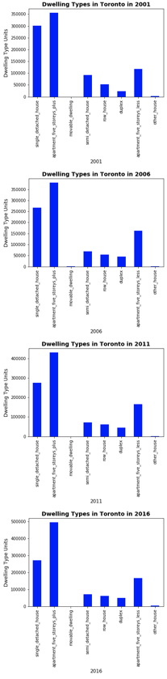
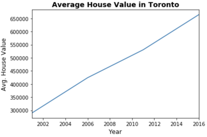

# PyViz-Project

## Pythonic Monopoly

Language Used: Python   

Libraries Used: Pandas, Matplotlib, hvplot, Plotly Express    

APIs used: Mapbox

## Objective:  
Harold's company has just started a new Real Estate Investment division to provide customers with a broader range of portfolio options. Harold was tasked with building a prototype dashboard, and he needs my help. The real estate team wants to trial this initial offering with investment opportunities for the Toronto market. If the new service is popular, then they can start to expand to other markets.

This dashboard's goal is to provide charts, maps, and interactive visualizations that help customers explore the data and determine if they want to invest in rental properties in Toronto.

## Files

* [toronto_neighbourhoods_census_data.csv](Starter_Code/Data/toronto_neighbourhoods_census_data.csv)

* [toronto_neighbourhoods_coordinates.csv](Starter_Code/Data/toronto_neighbourhoods_coordinates.csv)

* [Rental Analysis Starter Jupyter Notebook](Starter_Code/rental_analysis.ipynb)

* [Dashboard Starter Jupyter Notebook](Starter_Code/dashboard.ipynb)

## Steps
### Rental Analysis

The first step to building the dashboard is to work out all of the calculations and visualizations in an analysis notebook. Once the code is running out, it can be copied over to a dashboard code and used with Panel to create the final layout. The Jupyter Notebook `rental_analysis.ipynb` was used to complete the following:

#### Dwelling Types Per Year

In this section, the number of dwelling types per year was calculated and the results were visualized as a bar chart using the Pandas plot function. By default, the colour of the bar charts is blue. However, it is hard to see the difference between the yearly data. So, the use of `color` parameter of the `plot()` function was made to change the colour of each bar chart manually.

| Default Bar Charts                                  | Colored Bar Charts                                   |
------------------------------------------------------|------------------------------------------------------|
| |  |

#### Average Monthly Shelter Costs in Toronto Per Year

In this section, it was required to visualize the average monthly shelter costs per year to understand rental income trends over time better. It visualized the average (mean) shelter cost for owned and rented dwellings per year and visualization was made as line charts.

1. Calculated the average monthly shelter costs for owned and rented dwellings for each year.

2. Visualized the monthly shelter costs per year as line charts.

    

#### Average House Value per Year

In this section, it was required to determine the average house value per year. An investor may want to understand better the sales price of the rental property over time. For example, a customer will want to know if they should expect an increase or decrease in the property value over time so they can determine how long to hold the rental property. The visualization of the `average_house_value` per year as a bar chart was made.

1. Calculated the mean `average_house_value` for each year.

2. Visualized the `average_house_value` per year as a line chart.

  

#### Average Prices By Neighbourhood

In this section, a comparison was made on the basis of the house value by neighbourhood.

1. A new DataFrame was created with the mean house values by neighbourhood per year.

2. The mean `average_house_value` per year was visualized with the neighbourhood as a dropdown selector.

The `hvplot` function was used to obtain the interactive dropdown selector for the neighbourhood.

  

#### Number of Dwelling Types per Year

In this section, the visualization for the number of dwelling types per year in each neighbourhood was created. The reason was to provide investors a tool to understand the evolution of dwelling types over the years.

The use of `hvplot` function was made to create an interactive visualization of the average number of dwelling types per year with a dropdown selector for the neighbourhood.

#### Top 10 Most Expensive Neighbourhoods

In this section, it was required to figure out which neighbourhoods are the most expensive. The mean house value for each neighbourhood was calculated and then the values were sorted to obtain the top 10 most expensive neighbourhoods on average. The results were plotted as a bar chart.

#### Neighbourhood Map

In this final section, the neighbourhood location data was read into the code and an interactive map with the average prices per neighbourhood was created. A scatter Mapbox object from Plotly express was used to create the visualization. 

**Note** One would require a MAPBOX API access key to view this visualization

  

#### Cost Analysis 

Plotly express offers a broad selection of interactive plots. In this section, the Plotly express was used to create a couple of plots that investors can interactively filter through and explore various factors related to the house value of Toronto's neighbourhoods.

1. A bar chart row facet was created to plot the average house values for all Toronto neighbourhoods per year. 

    
   

2. A sunburst chart was created to conduct a cost analysis of the most expensive neighbourhoods in Toronto per year. 

 
    

### Dashboard

Now that all of the code and analysis has been worked out, the Panel library was used to build an interactive dashboard for all of the visualizations. 

The Jupyter Notebook `dashboard.ipynb` was used for the dashboard code. The code for each visualization was copied over and placed into separate functions (1 function per visualization).  Each function returns the plot figure in a format that Panel can use to plot the visualization.

Sample Dashboard:

  
