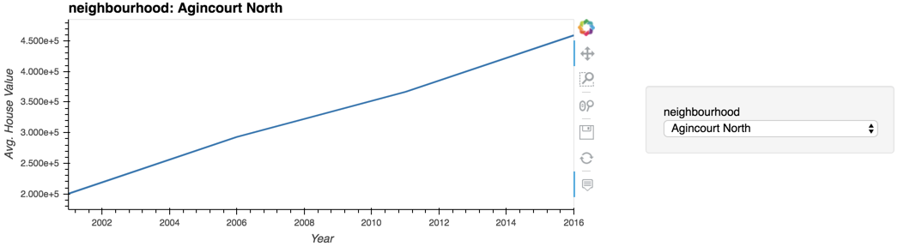

# PyViz-Project

## Pythonic Monopoly

Language Used: Python   

Libraries Used: Pandas, Matplotlib, hvplot, Plotly Express    

APIs used: Mapbox

## Objective:  
Harold's company has just started a new Real Estate Investment division to provide customers with a broader range of portfolio options. Harold was tasked with building a prototype dashboard, and he needs my help. The real estate team wants to trial this initial offering with investment opportunities for the Toronto market. If the new service is popular, then they can start to expand to other markets.

This dashboard's goal is to provide charts, maps, and interactive visualizations that help customers explore the data and determine if they want to invest in rental properties in Toronto.

## Files

* [toronto_neighbourhoods_census_data.csv](Starter_Code/Data/toronto_neighbourhoods_census_data.csv)

* [toronto_neighbourhoods_coordinates.csv](Starter_Code/Data/toronto_neighbourhoods_coordinates.csv)

* [Rental Analysis Starter Jupyter Notebook](Starter_Code/rental_analysis.ipynb)

* [Dashboard Starter Jupyter Notebook](Starter_Code/dashboard.ipynb)

## Steps
### Rental Analysis

The first step to building the dashboard is to work out all of the calculations and visualizations in an analysis notebook. Once the code is running out, it can be copied over to a dashboard code and used with Panel to create the final layout. I used the `rental_analysis.ipynb` to complete the following:

#### Dwelling Types Per Year

In this section, I calculated the number of dwelling types per year and visualized the results as a bar chart using the Pandas plot function. By default, the colour of the bar charts is blue. However, it is hard to see the difference between the yearly data. So, I used the `color` parameter of the `plot()` function to change the colour of each bar chart manually.

| Default Bar Charts                                  | Colored Bar Charts                                   |
------------------------------------------------------|------------------------------------------------------|
| |  |

#### Average Monthly Shelter Costs in Toronto Per Year

In this section, I wanted to visualize the average monthly shelter costs per year to understand rental income trends over time better. I visualized the average (mean) shelter cost for owned and rented dwellings per year and visualized it as line charts.

1. Calculated the average monthly shelter costs for owned and rented dwellings for each year.

2. Visualized the monthly shelter costs per year as line charts.

    

#### Average House Value per Year

In this section, I wanted to determine the average house value per year. An investor may want to understand better the sales price of the rental property over time. For example, a customer will want to know if they should expect an increase or decrease in the property value over time so they can determine how long to hold the rental property. I visualized the `average_house_value` per year as a bar chart.

1. Calculated the mean `average_house_value` for each year.

2. Visualized the `average_house_value` per year as a line chart.

  

#### Average Prices By Neighbourhood

In this section, I compared the house value by neighbourhood.

1. Created a new DataFrame with the mean house values by neighbourhood per year.

2. Visualized the mean `average_house_value` per year with the neighbourhood as a dropdown selector.

I used `hvplot` to obtain the interactive dropdown selector for the neighbourhood.

  

#### Number of Dwelling Types per Year

In this section, I visualized the number of dwelling types per year in each neighbourhood. I wanted to provide investors a tool to understand the evolution of dwelling types over the years.

I used `hvplot` to create an interactive visualization of the average number of dwelling types per year with a dropdown selector for the neighbourhood.

#### Top 10 Most Expensive Neighbourhoods

In this section, I tried to figure out which neighbourhoods are the most expensive. I calculated the mean house value for each neighbourhood and then sorted the values to obtain the top 10 most expensive neighbourhoods on average. Plotted the results as a bar chart.

#### Neighbourhood Map

In this final section, I read in the neighbourhood location data and built an interactive map with the average prices per neighbourhood. Used a scatter Mapbox object from Plotly express to create the visualization. 

**Note** You will need an MAPBOX API access key to view this visualization

  

#### Cost Analysis 

Plotly express offers a broad selection of interactive plots. In this I used Plotly express to a couple of plots that investors can interactively filter and explore various factors related to the house value of Toronto's neighbourhoods.

1. Created a bar chart row facet to plot the average house values for all Toronto neighbourhoods per year. 

    
   

2. Created a sunburst chart to conduct a cost analysis of the most expensive neighbourhoods in Toronto per year. 

 
    

### Dashboard

Now that all of the code and analysis has been worked out, I used the Panel library to build an interactive dashboard for all of the visualizations. 

I used the `dashboard.ipynb` starter notebook for the dashboard code. I copied over the code for each visualization and placed this into separate functions (1 function per visualization).  Each function returns the plot figure in a format that Panel can use to plot the visualization.

Sample Dashboard:

  
